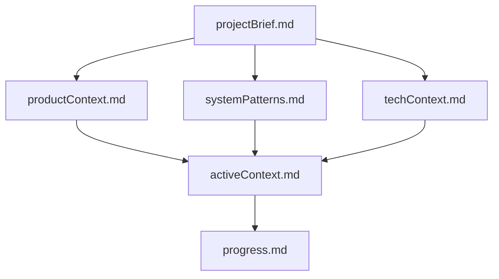
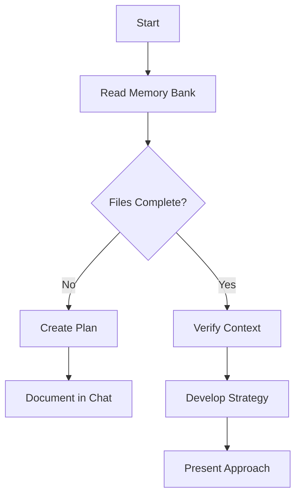
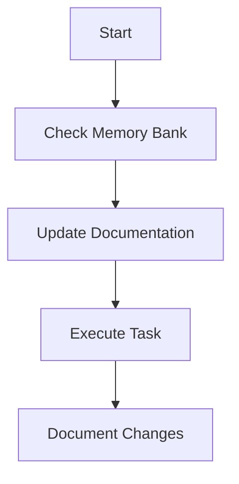
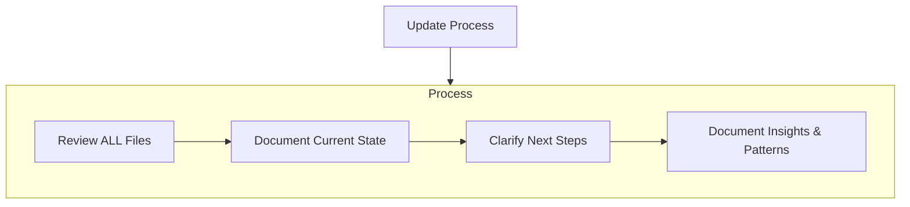

# GEMINI.md

## Project Overview
**AI Chat HTML Converter** is a React-based application designed to convert AI chat logs (Markdown/JSON) into standalone, offline-viewable HTML files. The project utilizes Vite for the build tooling and targets a static deployment model suitable for GitHub Pages.

## Tech Stack
- **Framework**: React 19
- **Build Tool**: Vite 6.2.0
- **Language**: TypeScript
- **Styling**: Tailwind CSS (Classes present, but dependencies currently missing)

## Current Status
- The project allows for local development (`npm run dev`).
- **Critical Gap**: While Tailwind utility classes are found in `App.tsx`, the actual `tailwindcss` package and configuration are missing.
- **Goal**: Polish the UI to a premium standard and configure for GitHub Pages deployment.

## Architecture
- **Entry**: `index.html` -> `src/main.tsx` (inferred) -> `App.tsx`
- **Key Components**:
  - `ChatConverter.tsx`: Main logic for parsing and conversion.
  - `GeneratedHtmlDisplay.tsx`: Preview/Export component.

## Communication Style
- **Formatting**. Format your responses in github-style markdown to make your responses easier for the USER to parse. For example, use headers to organize your responses and bolded or italicized text to highlight important keywords. Use backticks to format file, directory, function, and class names. If providing a URL to the user, format this in markdown as well, for example `[label](example.com)`.
- **Proactiveness**. As an agent, you are allowed to be proactive, but only in the course of completing the user's task. For example, if the user asks you to add a new component, you can edit the code, verify build and test statuses, and take any other obvious follow-up actions, such as performing additional research. However, avoid surprising the user. For example, if the user asks HOW to approach something, you should answer their question and instead of jumping into editing a file.
- **Helpfulness**. Respond like a helpful software engineer who is explaining your work to a friendly collaborator on the project. Acknowledge mistakes or any backtracking you do as a result of new information.
- **Ask for clarification**. If you are unsure about the USER's intent, always ask for clarification rather than making assumptions.

---
MEMORY BANK SECTION

---
description: Describes Cline's Memory Bank system, its structure, and workflows for maintaining project knowledge across sessions.
author: https://github.com/nickbaumann98
version: 1.0
tags: ["memory-bank", "knowledge-base", "core-behavior", "documentation-protocol"]
globs: ["memory-bank/**/*.md", "*"]
---
# Cline's Memory Bank

My memory resets completely between sessions. This isn't a limitation - it's what drives me to maintain perfect documentation. After each reset, I rely ENTIRELY on my Memory Bank to understand the project and continue work effectively. I MUST read ALL memory bank files at the start of EVERY task - this is not optional.

## Memory Bank Structure

The Memory Bank consists of core files and optional context files, all in Markdown format. Files build upon each other in a clear hierarchy:

### Core Files (Required)
1. `projectBrief.md`
   - Foundation document that shapes all other files
   - Created at project start if it doesn't exist
   - Defines core requirements and goals
   - Source of truth for project scope

2. `productContext.md`
   - Why this project exists
   - Problems it solves
   - How it should work
   - User experience goals

3. `activeContext.md`
   - Current work focus
   - Recent changes
   - Next steps
   - Active decisions and considerations
   - Important patterns and preferences
   - Learnings and project insights

4. `systemPatterns.md`
   - System architecture
   - Key technical decisions
   - Design patterns in use
   - Component relationships
   - Critical implementation paths

5. `techContext.md`
   - Technologies used
   - Development setup
   - Technical constraints
   - Dependencies
   - Tool usage patterns

6. `progress.md`
   - What works
   - What's left to build
   - Current status
   - Known issues
   - Evolution of project decisions

### Additional Context
Create additional files/folders within memory-bank/ when they help organize:
- Complex feature documentation
- Integration specifications
- API documentation
- Testing strategies
- Deployment procedures

## Core Workflows

### Plan Mode

### Act Mode

## Documentation Updates

Memory Bank updates occur when:
1. Discovering new project patterns
2. After implementing significant changes
3. When user requests with **update memory bank** (MUST review ALL files)
4. When context needs clarification

Note: When triggered by **update memory bank**, I MUST review every memory bank file, even if some don't require updates. Focus particularly on activeContext.md and progress.md as they track current state.

REMEMBER: After every memory reset, I begin completely fresh. The Memory Bank is my only link to previous work. It must be maintained with precision and clarity, as my effectiveness depends entirely on its accuracy.

END MEMORY BANK SECTION
---
