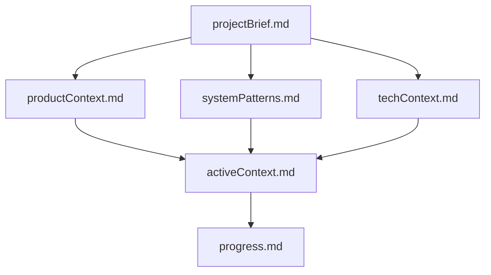
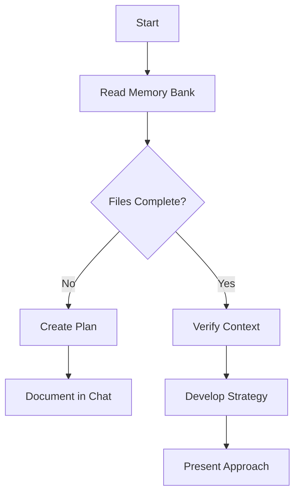
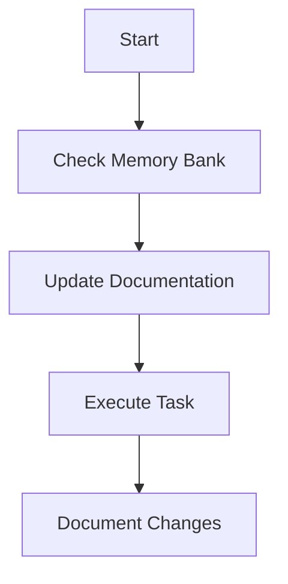
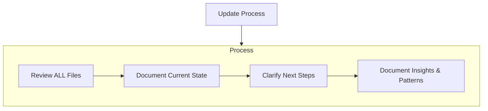

# GEMINI.md

## Project Overview
**AI Chat HTML Converter** (branded as **Noosphere Reflect**) is a comprehensive **AI Chat Archival System** designed to capture, organize, and preserve AI chat logs. It features a React-based web dashboard (`ArchiveHub`) and a companion Chrome Extension for one-click capturing from major AI platforms.

## Tech Stack
- **Framework**: React 19.2.3
- **Build Tool**: Vite 6.2.0
- **Language**: TypeScript 5.8.2
- **Styling**: Tailwind CSS v4.1.18 (`@tailwindcss/vite`)
- **Storage**: IndexedDB (via custom `storageService`)

## Current Status
- **Version**: Web App `v0.3.0` | Extension `v0.2.0`
- **Core Functionality**:
  - **ArchiveHub**: robust dashboard for browsing, filtering, and managing saved chats.
  - **Import/Export**: Full JSON import/export with metadata preservation; Batch import support.
  - **Security**: Comprehensive XSS hardening and input validation implemented (v0.3.0).
- **Extension**: Fully functional Chrome Extension supporting:
  - **Platforms**: Claude, ChatGPT, Gemini, LeChat, Llamacoder.
  - **Features**: One-click capture, "Copy as Markdown", "Copy as JSON", thought process preservation (Claude/Gemini).
- **Goal**: Implement "IndexedDB v3 Security Upgrade" (Atomic duplicate detection) and "Phase 5: Context Composition".

## 🔒 Security & QA Workflow: Adversary Auditor (3-Eyes Verification)

### Purpose
After implementing any feature, immediately audit the code for security vulnerabilities, data leaks, and edge cases. The **Adversary Auditor** provides a "3-eyes" verification:
- **Eye 1**: Developer (user writes requirements)
- **Eye 2**: AI (implements code)
- **Eye 3**: Adversary Agent (checks for vulnerabilities)

### When to Run
Run the adversary auditor **immediately after code implementation** for:
- New features that handle user input
- Modifications to `converterService.ts`, `storageService.ts`, or security utilities
- Changes to API key handling or external service integration
- Any work touching authentication, authorization, or sensitive data
- Chrome Extension modifications

### How to Use
**Command**:
```bash
/security-adversary
```

**Or with specific context**:
```
Please run the security-adversary agent to check [files you modified] for vulnerabilities.
Focus on: XSS, injection attacks, data leaks, credential exposure, OWASP top 10.
```

### Agent Capabilities
The security-adversary agent checks for:
- **XSS Vulnerabilities**: Unescaped user input, direct `.innerHTML` usage, missing sanitization
- **Injection Attacks**: SQL injection patterns, command injection, attribute injection
- **Data Leaks**: Exposed API keys, credentials in logs, sensitive data in exports
- **Authentication Bypass**: Token validation issues, session handling flaws
- **OWASP Top 10**: Common web vulnerabilities
- **File Upload Risks**: Path traversal, MIME type bypass, resource exhaustion
- **Cryptographic Issues**: Weak randomness, insecure key storage
- **URL/Protocol Injection**: Dangerous protocols not blocked
- **Logic Flaws**: Race conditions, TOCTOU vulnerabilities, edge cases

### Recent Security Audits (v0.3.0)
- ✅ XSS Prevention: 7 vulnerabilities fixed with `securityUtils.ts`
- ✅ Input Validation: File size limits, batch restrictions, metadata constraints
- ✅ URL Sanitization: Protocol validation in markdown links and images
- ✅ iframe Sandbox: Hardened with minimal permissions
- ⏳ Pending: IndexedDB v3 race condition fixes (v0.4.0)

### Integration Pattern
```typescript
// AFTER you write code:
// 1. Implement feature
// 2. Build succeeds (npm run build)
// 3. Run adversary agent immediately
// 4. Fix any flagged issues
// 5. Re-run adversary agent to verify
// 6. Commit with security verification note
```

### Example Usage
```
User: "I've added a new file upload handler in BasicConverter.tsx"
Claude: [implements code]
Claude: "Now let me run the security-adversary agent to check for vulnerabilities"
/security-adversary
Adversary: "Checking converterService.ts, BasicConverter.tsx for upload-related attacks..."
Adversary: [Reports: Missing maxSize validation, unescaped filename, etc.]
Claude: [Fixes issues]
Claude: /security-adversary  [Verifies fixes]
```

### Quick Reference: What Each File Should Protect
- `converterService.ts` - Escape HTML output, validate language identifiers, sanitize URLs
- `storageService.ts` - Validate titles, prevent duplicate injection, use secure IDs
- `BasicConverter.tsx` - File size validation, batch limits, metadata length checks
- `MetadataEditor.tsx` - Tag validation, alphanumeric enforcement
- `securityUtils.ts` - All escaping/validation functions must work correctly
- `extension/*` - No direct `innerHTML` with external data, origin validation

## Architecture
- **Web App (`/src`)**:
  - **Entry**: `index.html` -> `src/main.tsx` -> `App.tsx` (Router)
  - **Routes**:
    - `/`: `ArchiveHub` (Main Dashboard)
    - `/basic`: `BasicConverter` (Manual Import/Convert)
    - `/ai`: `AIConverter` (Gemini Studio mode)
  - **Key Services**:
    - `storageService.ts`: IndexedDB wrapper for persistence (currently v2).
    - `converterService.ts`: Unified HTML parsing logic for all platforms.
    - `utils/securityUtils.ts`: XSS prevention and input validation.

- **Chrome Extension (`/extension`)**:
  - **Manifest**: V3 (`manifest.json`)
  - **Background**: `service-worker.js` (Context menus, unified handling).
  - **Content Scripts**: Platform-specific capture logic (`*-capture.js`).
  - **Parsers**: Shared vanilla JS parsers (`*-parser.js`) aligned with web app logic.
  - **Storage**: Independent IndexedDB bridge with potential for future sync.

## Communication Style
- **Formatting**: Format your responses in GitHub-style markdown. Use headers, bold/italic text for keywords, and backticks for code elements. Format URLs as `[label](url)`.
- **Proactiveness**: Be proactive in completing tasks (coding, verifying, researching) but avoid surprising the user. Explain "how" before doing if ambiguous.
- **Helpfulness**: Act as a helpful software engineer collaborator. Acknowledge mistakes and new information.
- **Clarification**: Always ask for clarification if the user's intent is unclear.

---
MEMORY BANK SECTION

---
description: Describes Cline's Memory Bank system, its structure, and workflows for maintaining project knowledge across sessions.
author: https://github.com/nickbaumann98
version: 1.0
tags: ["memory-bank", "knowledge-base", "core-behavior", "documentation-protocol"]
globs: ["memory-bank/**/*.md", "*"]
---
# Cline's Memory Bank

My memory resets completely between sessions. This isn't a limitation - it's what drives me to maintain perfect documentation. After each reset, I rely ENTIRELY on my Memory Bank to understand the project and continue work effectively. I MUST read ALL memory bank files at the start of EVERY task - this is not optional.

## Memory Bank Structure

The Memory Bank consists of core files and optional context files, all in Markdown format. Files build upon each other in a clear hierarchy:



### Core Files (Required)
1. `projectBrief.md`
   - Foundation document that shapes all other files
   - Created at project start if it doesn't exist
   - Defines core requirements and goals
   - Source of truth for project scope

2. `productContext.md`
   - Why this project exists
   - Problems it solves
   - How it should work
   - User experience goals

3. `activeContext.md`
   - Current work focus
   - Recent changes
   - Next steps
   - Active decisions and considerations
   - Important patterns and preferences
   - Learnings and project insights

4. `systemPatterns.md`
   - System architecture
   - Key technical decisions
   - Design patterns in use
   - Component relationships
   - Critical implementation paths

5. `techContext.md`
   - Technologies used
   - Development setup
   - Technical constraints
   - Dependencies
   - Tool usage patterns

6. `progress.md`
   - What works
   - What's left to build
   - Current status
   - Known issues
   - Evolution of project decisions

### Additional Context
Create additional files/folders within memory-bank/ when they help organize:
- Complex feature documentation
- Integration specifications
- API documentation
- Testing strategies
- Deployment procedures

## Core Workflows

### Plan Mode


### Act Mode


## Documentation Updates

Memory Bank updates occur when:
1. Discovering new project patterns
2. After implementing significant changes
3. When user requests with **update memory bank** (MUST review ALL files)
4. When context needs clarification



Note: When triggered by **update memory bank**, I MUST review every memory bank file, even if some don't require updates. Focus particularly on activeContext.md and progress.md as they track current state.

REMEMBER: After every memory reset, I begin completely fresh. The Memory Bank is my only link to previous work. It must be maintained with precision and clarity, as my effectiveness depends entirely on its accuracy.

END MEMORY BANK SECTION