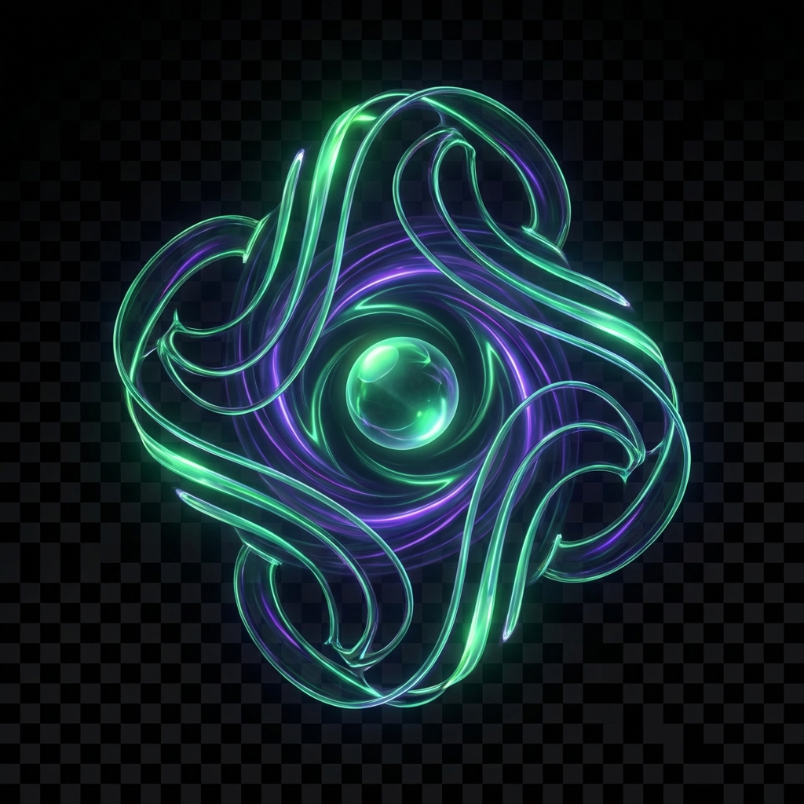

<p align="center">
  
</p>

# Noosphere Reflect

> [!NOTE]  
> **100% Agent-Engineered Architecture**  
> This project was developed entirely through AI agent collaboration utilizing the [**AGENT framework**](https://gist.github.com/acidgreenservers/001185d63e5cd65f9fbe6f7a1c70a200) from **Noosphere Steward**. It stands as a real-world demonstration of autonomous agent capabilities: taking complex software specifications—from client-side storage boundaries to multi-platform Chrome Extension bridges—and executing them into production-ready software. Every parser, state transition, and security boundary in this repository was built to demonstrate that structured agent workflows can deliver robust, sovereign software without manual code authoring.

<div align="center">

[](LICENSE)
[](CHANGELOG.md)
[](https://github.com/acidgreenservers/Noosphere-Reflect/actions)
[](package.json)
[](tsconfig.json)

</div>

<div align="center">
<table>
<tr>
<td align="center"><a href="docs/images/chat-workspace.png"></a></td>
<td align="center"><a href="docs/images/projects-hub.png"></a></td>
<td align="center"><a href="docs/images/document-builder.png"></a></td>
<td align="center"><a href="docs/images/artifact-sidebar.png"></a></td>
</tr>
<tr>
<td align="center"><b>Unified WebChat Canvas</b></td>
<td align="center"><b>Projects & Context Hub</b></td>
<td align="center"><b>Document Builder</b></td>
<td align="center"><b>Artifacts & Profiles</b></td>
</tr>
</table>
</div>

**Preserve Meaning Through Memory** — A highly secure, client-side AI chat archival and workspace system featuring a companion Chrome Extension for high-fidelity capture across Claude, ChatGPT, Gemini, LeChat, Grok, Llamacoder, Kimi, Google AI Studio, and Brave.

<div align="center">

### [**Live Application**](https://acidgreenservers.github.io/Noosphere-Reflect/) | [**Quickstart Guide**](QUICKSTART.md) | [**Architecture**](ARCHITECTURE.md) | [**Security Policy**](SECURITY.md)

</div>

---

## Why This Exists?

The AI conversational ecosystem is highly fragmented. Power users routinely jump between Claude, ChatGPT, Gemini, and local LLMs—leaving valuable ideas, code snippets, and intellectual workflows trapped in isolated vendor silos. Traditional conversation history disappears behind platform updates, export formats change without notice, and cloud synchronization compromises privacy.

**Noosphere Reflect** was created to restore total data sovereignty to personal AI interactions. Built around a familiar, webchat-native canvas, it provides a unified client-side workspace where retroactive session history, prompt templates, memories, skills, workflows, agents, artifacts, and projects are captured with high fidelity and preserved entirely locally.

### Core System Mandates
To fulfill true preservation, Noosphere Reflect adheres to four strict principles:
- **Zero-Telemetry Client Sovereignty**: All session files, memories, and prompt artifacts remain inside local browser storage (`IndexedDB`). No external databases or analytics tracking.
- **Universal Multi-Platform Parsing**: Modular DOM scrapers seamlessly ingest structured chats and raw thinking chains from commercial and open-weight AI web clients via a companion Chrome extension.
- **High-Fidelity Document Synthesis**: An integrated in-chat Markdown document workspace to extract, organize, and synthesize model turns into clean deliverables.
- **Off-Thread High-Speed Search**: Instant full-text indexing and query execution across thousands of conversations without main-thread UI lag.

---

## Features

### 💬 Unified WebChat Canvas
- **Familiar Chat Architecture**: Designed after modern AI interfaces for intuitive interaction, complete with retroactive conversation replay and turn-level attachments.
- **Thinking Block Rendering**: Native support for hidden or expanded model reasoning chains ("Thinking Blocks"), preserving full execution fidelity from high-reasoning LLMs.
- **Rich HTML & Code Rendering**: In-line sandbox supporting full HTML preview, interactive code snippets, and custom console styling locked to `65ch` reading widths.
- **Turn Controls & Feedback**: Hover actions on every message turn for **Copy**, **Fork**, **Edit**, and **Save As** (Memory, Prompt, Skill, or Workflow) with instant visual verification cues (`✓`).

### 📁 Projects & Context Hub
- **Isolated Workspaces**: Group related chats, uploaded artifacts, static files, and prompts inside dedicated Project containers (similar to Claude Projects / GPTs).
- **Context Injection**: Attach project-level knowledge directly into conversation turns to maintain topic alignment across long-running sessions.

### 👤 Custom Profiles & Instructions
- **Global & Local Preferences**: Define custom system instructions, user background context, and persona constraints across chats.
- **Behavioral Profiles**: Quickly toggle instruction profiles to tailor model responses for coding, technical writing, or creative brainstorming.

### 🧩 Modular Scrapers & Granular Export System
- **Updated Extension Scrapers**: High-fidelity capture engine targeting major web interfaces with individual styling support:
  - **Claude** (`claude.ai`) — 🟠 Orange Theme
  - **ChatGPT** (`chatgpt.com`) — 🟢 Green Theme
  - **Gemini** (`gemini.google.com`) — 🔵 Blue Theme
  - **LeChat** (`chat.mistral.ai`) — 🟡 Amber Theme
  - **Grok** (`x.ai`) — ⚫ Black Theme
  - **Llamacoder** (`llamacoder.together.ai`) — ⚪ White Theme
  - **Google AI Studio** (`aistudio.google.com`) — 🔵 Blue Theme
  - **Kimi** (`kimi.moonshot.cn`) — 🟣 Purple Theme
  - **Brave** (`brave.com`) — 🦁 Lion Theme
- **Granular Export Utilities**: Export full sessions or specific sub-trees to JSON, Markdown, or raw database backups with full structural metadata.

### 📝 In-Chat Document Builder & Artifacts
- **Sliding Workspace Pane**: Dynamic split-screen panel (`30vw` to `90vw`) with real-time Markdown rendering.
- **Direct Segment Insertion**: Select text snippets directly from chat responses and append them directly into your draft document.
- **Centralized Artifact Reader**: Drawer interface to review, inspect, and download image attachments, code artifacts, and session files.

### ⚡ Search Engine & Local Persistence
- **Off-Thread MiniSearch**: Background Web Worker (`SearchWorker`) running MiniSearch for instant indexing across chats, memories, prompts, and skills.
- **Archive Hub**: Full organization dashboard for saved sessions, project tags, search filters, and database maintenance.

---

## Technology Stack

### Core Frontend
- **Framework**: React 19 & TypeScript 5.8
- **Build Tool**: Vite 6.2
- **Styling**: Tailwind CSS v4 (Glassmorphic dark-amber design system)
- **Icons**: Lucide React

### Storage & Search Engine
- **Persistence Layer**: `IndexedDB` wrapped via `idb` (`StorageService`)
- **Full-Text Search**: MiniSearch off-loaded to a Web Worker (`SearchWorker`)
- **Sanitization**: `DOMPurify` enforcing multi-tier XSS protection

### Cloud Backup
> Feature not fully finished

- **Drive Sync**: Google Drive API (optional manual OAuth2 sync.)

---

## Project Structure


```

Noosphere-Reflect/
├── public/                 # Static assets, logo, & icons
├── src/
│   ├── components/        # React UI components
│   │   ├── artifacts/     # Artifact list drawer & visual readers
│   │   ├── chat/          # WebChat canvas, message turns, thinking blocks, & inputs
│   │   ├── document/      # In-chat sliding markdown document workspace
│   │   ├── modal/         # Save Modals, Profile Editor, & Project dialogs
│   │   ├── profile/       # User profile & system instruction managers
│   │   ├── projects/      # Project containers & context hub views
│   │   └── sidebar/       # Collapsible navigation & hub view
│   ├── services/          # Core operational layer
│   │   ├── StorageService.ts # IndexedDB interface
│   │   └── SearchWorker.ts   # Off-thread MiniSearch worker
│   ├── styles/            # Tailwind CSS v4 themes & styles
│   ├── types/             # TypeScript type definitions
│   ├── App.tsx            # Root application routing & context
│   └── main.tsx           # Web application entry point
├── extension/             # Companion Chrome Extension modular DOM scrapers
├── docs/                  # Architecture & engineering guides
├── vite.config.ts         # Vite build configuration
├── tsconfig.json          # TypeScript project configuration
├── package.json           # Dependencies & scripts
└── README.md

```

---

## Getting Started

### Prerequisites
- **Node.js**: `20.x` or higher
- **npm**: `10.x` or higher
- **Browser**: Google Chrome or Chromium-based browser (for companion Chrome Extension)

> **Note**: This repository is a 100% client-side web application. It does not require Python, Docker, or external backend server processes.

### Quick Start

1. **Clone the repository**:
```bash
   git clone [https://github.com/acidgreenservers/Noosphere-Reflect.git](https://github.com/acidgreenservers/Noosphere-Reflect.git)
   cd Noosphere-Reflect
```

2. **Install dependencies**:
```bash
npm install
```


3. **Start the development server**:
```bash
npm run dev
```


4. **Access the application**:
Open your browser to `http://localhost:3000/Noosphere-Reflect/`

### Build & Verification Commands

```bash
# Compile production bundle to /dist
npm run build

# Execute unit and integration tests
npm test

# Run code style and linting checks
npm run lint
```

---

## Environment Variables

All settings are managed within the web UI. Optional environment variables can be provided in `.env` for development integrations:

| Variable | Description | Default |
| --- | --- | --- |
| `VITE_GOOGLE_CLIENT_ID` | OAuth 2.0 Client ID for Google Drive cloud sync | *None* |
| `VITE_GOOGLE_CLIENT_SECRET` | OAuth 2.0 Client Secret for Google Drive cloud sync | *None* |

---

## Architecture

Noosphere Reflect implements a **Bridge Pattern** to decouple browser extension scrapers from storage layers:

```text
  [ AI Web Platforms ] --(Extension Bridge)--> [ Web UI Canvas ] --(StorageService)--> [ IndexedDB ]
                                                       |                                   |
                                                       +----(Markdown/JSON Import)--------+
```

For full schematics, schema configurations, and worker pipelines, refer to **[ARCHITECTURE.md](ARCHITECTURE.md)**.

---

## Security Policy

Security is enforced at the local storage boundary:

* **Data Isolation**: 100% of data lives locally in `IndexedDB`.
* **XSS Prevention**: Strict `DOMPurify` filters run on data ingestion, HTML turns, and document rendering.
* **Input Guardrails**: Dedicated modals protect against database state corruption.

Review **[SECURITY.md](SECURITY.md)** for detailed security practices and vulnerability reporting protocols.

---

## License

This project is licensed under the **AGPL-3.0 License**. See the [LICENSE](https://www.google.com/search?q=LICENSE) file for complete details.
